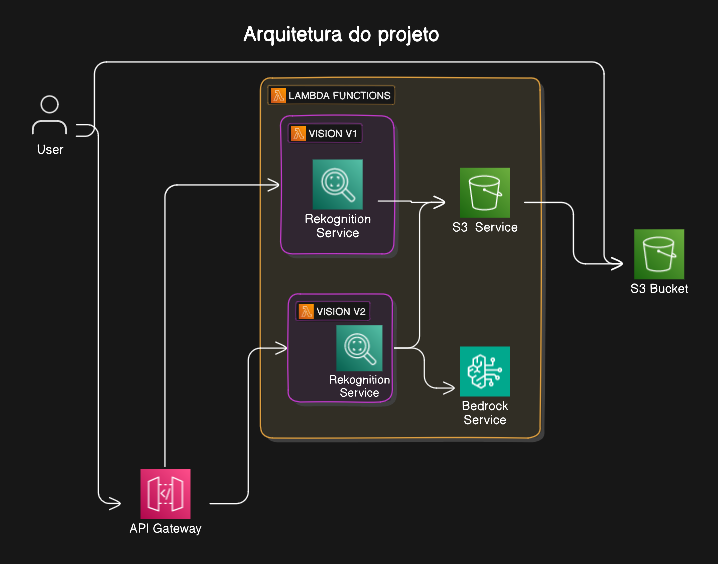

# Desenvolvimento da aplicação ***FacePet*** 🦮🚶‍♂️

O projeto tem como objetivo o desenvolvimento de uma API capaz de reconhecer pessoas e suas emoções através do Amazon Rekognition, utilizando o framework Serverless e recebendo imagens postadas manualmente em um bucket no Amazon S3. Com ela, também é possível reconhecer pets e trazer dicas de cuidados, comportamento e saúde através do Amazon Bedrock.


## 👨‍💻 Autores

- [Adelson Nunes](https://github.com/imrooteodoro)
- [Isabela Buzzo](https://github.com/isabelabuzzo)
- [Leandro Pereira](https://github.com/leojgpereira)
- [Letícia Cristina Leme](https://github.com/leticiaaleme)


## :gear: Funcionamento
### :slightly_smiling_face: Parte 1 - Detecção de faces e emoções
A rota `/v1/vision` é responsável por receber um json via POST identificando o bucket do Amazon S3 e qual a imagem a ser analisada pelo AWS Rekognition. O seu objetivo é retornar as faces identificadas na imagem e, junto delas, retornar suas emoções.

*Exemplo de entrada*

```json
{ 
   "bucket": "nome_do_bucket", 
   "imageName": "imagem-teste.jpg" 
}
```

A rota retornará a localização das faces reconhecidas, a localização de cada uma delas, a emoção detectada e o nível de confiança da classificação realizada.
```json
{
    "url_to_image": "https://url_do_bucket/imagem-teste.png",
    "created_image": "01-01-2024 10:10:10",
    "faces": [
        {
            "position": {
                "Width": 0.09942790865898132,
                "Height": 0.19947189092636108,
                "Left": 0.5377042293548584,
                "Top": 0.13642698526382446
            },
            "classified_emotion": "HAPPY",
            "classified_emotion_confidence": 100.0
        },
        {
            "position": {
                "Width": 0.09572228044271469,
                "Height": 0.20226939022541046,
                "Left": 0.370543509721756,
                "Top": 0.19134210050106049
            },
            "classified_emotion": "HAPPY",
            "classified_emotion_confidence": 100.0
        }
    ]
}
```

Caso nenhuma face seja reconhecida, os campos serão retornados como nulos.
```json
{
    "url_to_image": "https://url_do_bucket/imagem-teste.png",
    "created_image": "01-01-2024 10:10:10",
    "faces": [
        {
            "position": {
                "Height": null,
                "Left": null,
                "Top": null,
                "Width": null
            },
            "classified_emotion": null,
            "classified_emotion_confidence": null
        }
    ]
}
```
A rota POST pode ser acessada por `https://dv5ei45bzk.execute-api.us-east-1.amazonaws.com/v1/vision`.

### :dog2: Parte 2 - Detecção de pets
Idêntico à parte 1, a rota `/v2/vision` também acessa um bucket do S3 e uma imagem como entrada. Porém, ao ser analisada pelo AWS Rekognition, a saída identifica os pets e faces presentes na imagem. Caso existam pets, uma dica será retornada utilizando o AWS Bedrock.
```json
{
    "url_to_image": "https://spring-8-eqp4.s3.amazonaws.com/pu_lab.jpg",
    "created_image": "29-06-2024 22:16:00",
    "pets": [
        {
            "Labels": [
                {
                    "Name": "Animal",
                    "Confidence": 99.6141128540039
                },
                {
                    "Name": "Canine",
                    "Confidence": 99.6141128540039
                },
                {
                    "Name": "Mammal",
                    "Confidence": 99.6141128540039
                },
                {
                    "Name": "Pet",
                    "Confidence": 99.00459289550781
                },
                {
                    "Name": "Dog",
                    "Confidence": 98.87330627441406
                },
                {
                    "Name": "Pug",
                    "Confidence": 98.7013931274414
                }
            ],
            "Dicas": "\nO tipo de pet identificado pelos labels fornecidos é um cão.\nDicas sobre o cão:\nNível de Energia e Necessidades de Exercícios: Os cães são animais de energia alta e geralmente necessitam de exercícios regularmente para mantê-los saudáveis e felizes.\nTemperamento e Comportamento: Os cães são carinhosos, inteligentes e sociáveis, e geralmente se adaptam bem a vidas em casa.\nCuidados e Necessidades: Os cães requerem alimentação balanceada, agua fresca, cuidados veterinários regulares, e um ambiente seguro e acolhedor.\nProblemas de Saúde Comuns: Alguns cães podem ser propensos a problemas de saúde como diabetes, hipoacusia, entre outros."
        },
        {
            "Labels": [
                {
                    "Name": "Animal",
                    "Confidence": 99.99201202392578
                },
                {
                    "Name": "Canine",
                    "Confidence": 99.99201202392578
                },
                {
                    "Name": "Dog",
                    "Confidence": 99.99201202392578
                },
                {
                    "Name": "Labrador Retriever",
                    "Confidence": 99.99201202392578
                },
                {
                    "Name": "Mammal",
                    "Confidence": 99.99201202392578
                },
                {
                    "Name": "Pet",
                    "Confidence": 99.99201202392578
                }
            ],
            "Dicas": "\nDog - Nível de energia alto e necessidades de exercícios moderadas. Temperamento amigável e sociável, prefiere acompanhado de seus donos. Cuidados básicos incluem alimentação balanceada, banho regular, exercícios e visitas ao veterinário. Problemas de saúde comuns podem incluir problemas de visão, oído, pele e dentes.\nDog - Nível de energia alto e necessidades de exercícios moderadas. Temperamento amigável e sociável, prefiere acompanhado de seus donos. Cuidados básicos incluem alimentação balanceada, banho regular, exercícios e visitas ao veterinário. Problemas de saúde comuns podem incluir problemas de visão, oído, pele e dentes."
        }
    ]
}
```
Caso nenhum pet seja detectado, os campos retornarão como nulos.
```json
{
    "url_to_image": "https://spring-8-eqp4.s3.amazonaws.com/pu_lab.jpg",
    "created_image": "29-06-2024 22:16:00",
    "pets": [
        {
            "Labels": [
                {
                    "Name": null,
                    "Confidence": null
                }
            ],
            "Dicas": null
        }
    ]
}
```

A rota POST pode ser acessada por `https://dv5ei45bzk.execute-api.us-east-1.amazonaws.com/v2/vision`.

## :writing_hand: Desenvolvimento
### Parte 1 - Detecção de faces e emoções
Para o funcionamento da parte inicial do projeto, foram desenvolvidas as funções `get_faces` e `recognize_faces`, responsáveis por, primeiramente, enviar a imagem ao AWS Rekognition. Depois disso, é iterado sob cada uma das faces reconhecidas, filtrando e retornando apenas os valores de interesse. No final, é definido o modelo de resposta.

### Parte 2 - Detecção de pets
No funcionamento da detecção de pets, foi desenvolvida, primeiramente, a função `get_pets`. Essa função envia a imagem ao AWS Rekognition e recupera seus rótulos. Depois disso, ao iterar em cada um dos pets presentes nas detecções, as localizações na imagem real também são salvas e é realizado um recorte da caixa limitadora de cada um desses pets utilizando a biblioteca Pillow e os recortes são retornados pela função. Esse processo faz com que seja possível que uma dica seja retornada, posteriormente, para cada pet existente na imagem, contornando o modelo de resposta original do Rekognition.

Depois disso, a função `recognize_pets` retorna a lista de recortes e a imagem original de um bucket do S3. Ao percorrer cada um dos recortes, é enviada uma requisição ao AWS Rekognition para que cada pet seja processado individualmente e, caso a label tenha mais que 60% de confiança, ela é selecionada. Por fim, as informações de cada pet são acrescidas de dicas geradas pelo Amazon Bedrock que, utilizando o modelo Amazon Titan, define um prompt para que dicas possam ser retornadas para cada pet presente.

## :hammer_and_wrench: Tecnologias e Ferramentas
- Amazon S3: serviço da AWS para armazenamento em nuvem.
- Serverless: criação e gestão da API.
- Amazon Rekognition: serviço de análise de imagens e vídeos.
- Amazon Bedrock: serviço gerenciado que disponibiliza modelos de base (FMs) de alta performance de IA Generativa.
- Pillow: Biblioteca Python para processamento de imagens.
- Trello: plataforma de gerenciamento de projetos.

## :telescope: Arquitetura do projeto

-

## 📁 Estrutura do projeto
```
└── 📁sprint-8-pb-aws-marco
    └── 📁lambda
         └── python.zip
    └── 📁visao-computacional
        └── 📁controllers
            └── VisionV1Controller.py
            └── VisionV2Controller.py
        └── 📁models
            └── Label.py
        └── 📁services
            └── BedrockService.py
            └── RekognitionService.py
            └── S3Service.py
        └── handler.py
        └── serverless.yml
```
## 📌 Instalação

### Pré-requisitos
- Serverless Framework: Instale o Serverless Framework globalmente.
```
npm install -g serverless
```

### Passo a Passo
- Configuração do AWS CLI: configure a AWS CLI no seu ambiente local.
```
aws configure
```
Insira suas credenciais da AWS e configure a região padrão.

```
$ aws configure
AWS Access Key ID: ACCESSKEYEXAMPLE
AWS Secret Access Key: SECRETKEYEXAMPLE
Default region name [None]: us-east-1
Default output format [None]: ENTER
```

- Configuração do Projeto Serverless: clone o Repositório do Projeto:

```
git clone https://github.com/Compass-pb-aws-2024-MARCO/sprint-8-pb-aws-marco.git
```
E navegue até a branch "grupo-4".

- Configuração do Serverless Framework:

Execute o comando a seguir, dentro da pasta `/visao-computacional`:
```
serverless deploy
```

- Configuração das funções lambda.
  
No console da AWS, acesse a sessão Lambda.

Dentro de *Layers*, selecione *Create layer* e dê upload no arquivo *python.zip*.

Em *functions*, acesse as funções responsáveis pelas rotas da aplicação `vision-dev-visionV1` e `vision-dev-vision21` e, na aba *layers* de cada uma, clique em *add a layer* e selecione a layer customizada que acabamos de criar. Esse processo possibilita o uso da biblioteca Pillow na aplicação.

## :ghost: Dificuldades conhecidas
- Houveram dificuldades em entender como poderia ser processada a resposta do Rekognition em relação aos pets. Como a resposta retorna todas as detecções diretamente, retornar uma dica para cada um dos pets na imagem requeriu um esforço maior. Porém, essa dificuldade foi contornada com o uso da biblioteca Pillow para recortar a imagem original.
- Também encontramos dificuldades em lidar com timeout no Bedrock. As respostas, muitas vezes, superavam o tempo limite de resposta do API Gateway por conta da utilização do Bedrock. Encontramos uma solução realizando mudanças nos atributos de processamento do modelo utilizado.
